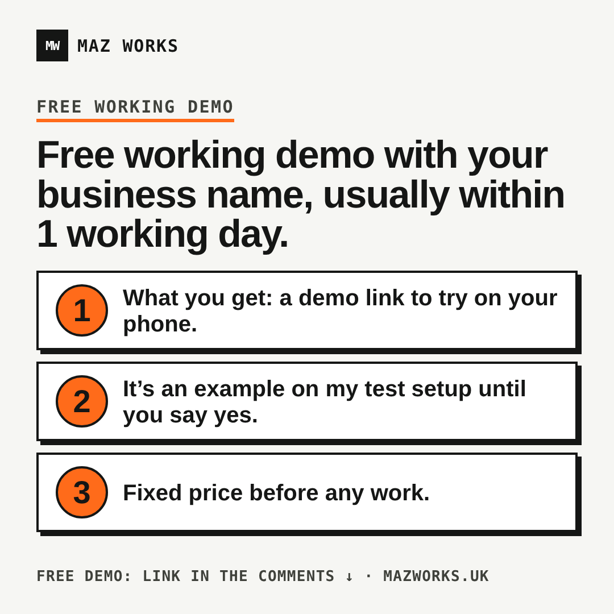
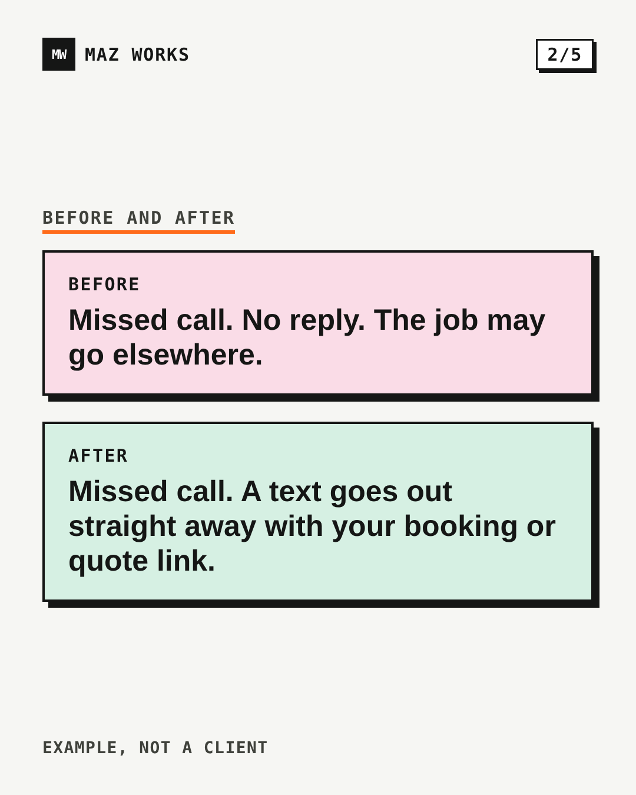
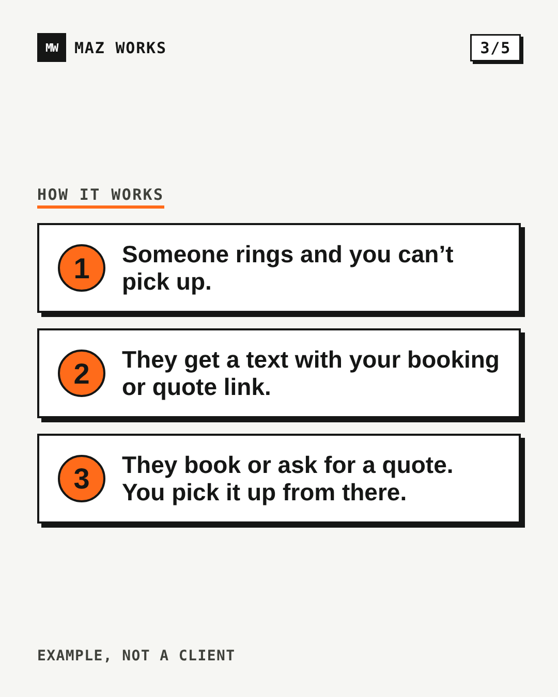
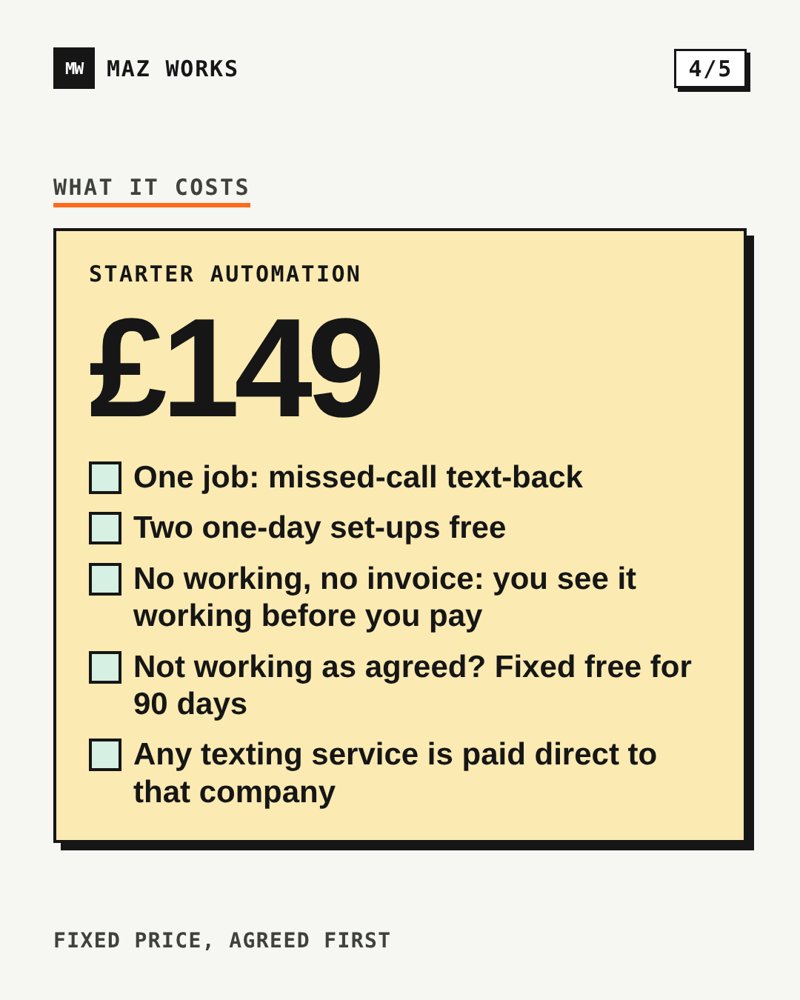
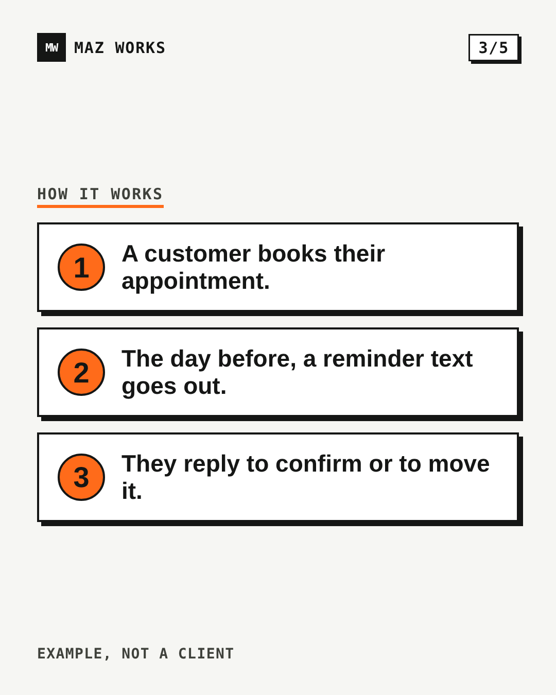
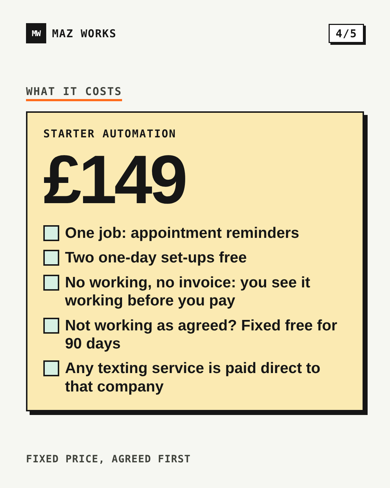
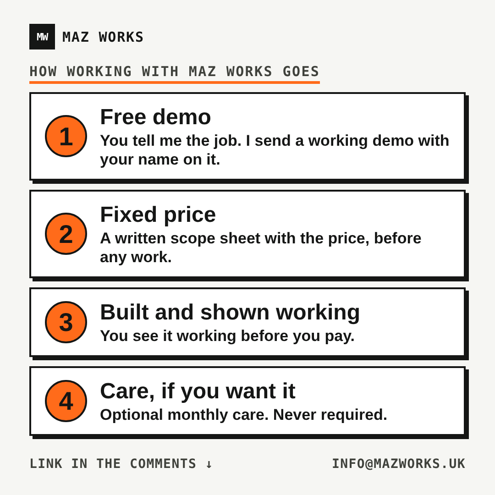
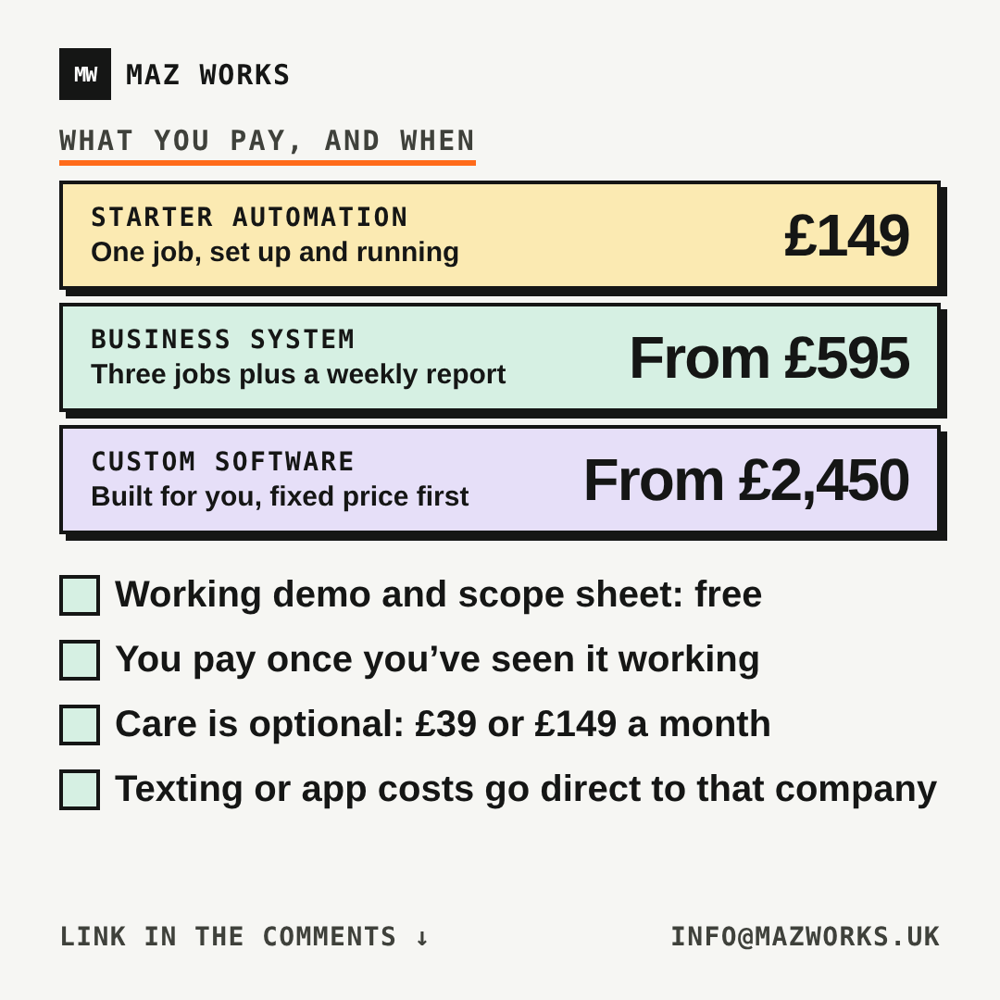

# Assets

Everything made for posting and branding, in one place. Copies only: the site still uses `public/` and `app/`.

| Folder | What it holds |
|---|---|
| `brand/` | Logo and icon files: `maz.webp`, `icon.svg`, `og-card.png`, `social-card.png`, `social-card.svg` |
| `promo/linkedin/carousel-missed-calls/` | Carousel 1 (trades): `slide-1..5.png` + `carousel.pdf` |
| `promo/linkedin/carousel-no-shows/` | Carousel 2 (appointments): `slide-1..5.png` + `carousel.pdf` |
| `promo/linkedin/infographics/` | `how-it-works.png`, `what-you-pay.png`, `free-demo.png` (1080x1080), `free-demo-1080x1350.png` |
| `promo/posts/POSTS.md` | Copy-paste post text and first-comment links |
| `promo/source/` | HTML sources and `render.mjs` |
| `video/` | Homepage demo: `demo.mp4`, `demo-poster.webp`, `demo.vtt` |

Rules: every scenario is labelled "Example, not a client". The call to action is "Get my free demo". Prices come from `app/offers.ts`; if they change, edit the HTML in `promo/source/` and re-render. Links use `https://www.mazworks.uk/free-plan?src=<tag>`; the link goes in the first comment, not the post.

## Re-render

From the repo root (needs Playwright and Chromium):

```
node assets/promo/source/render.mjs
```

This rebuilds every PNG and both carousel PDFs. Edit the paths at the top of `render.mjs` if Playwright lives elsewhere.

## Thumbnails

Hero offer: 

Carousel 1:     

Carousel 2:     

Infographics:  

Alt text: read the headline on each slide in order.
