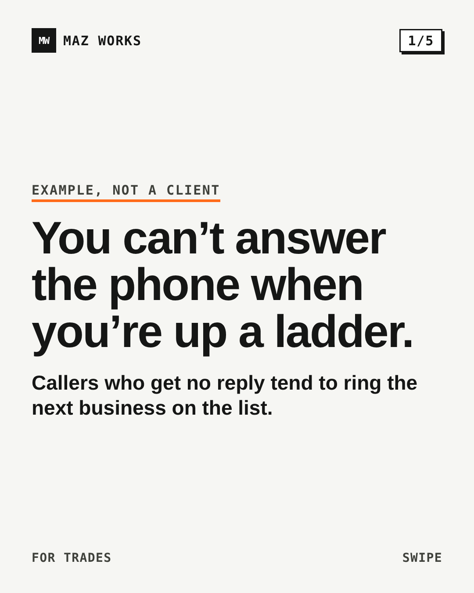
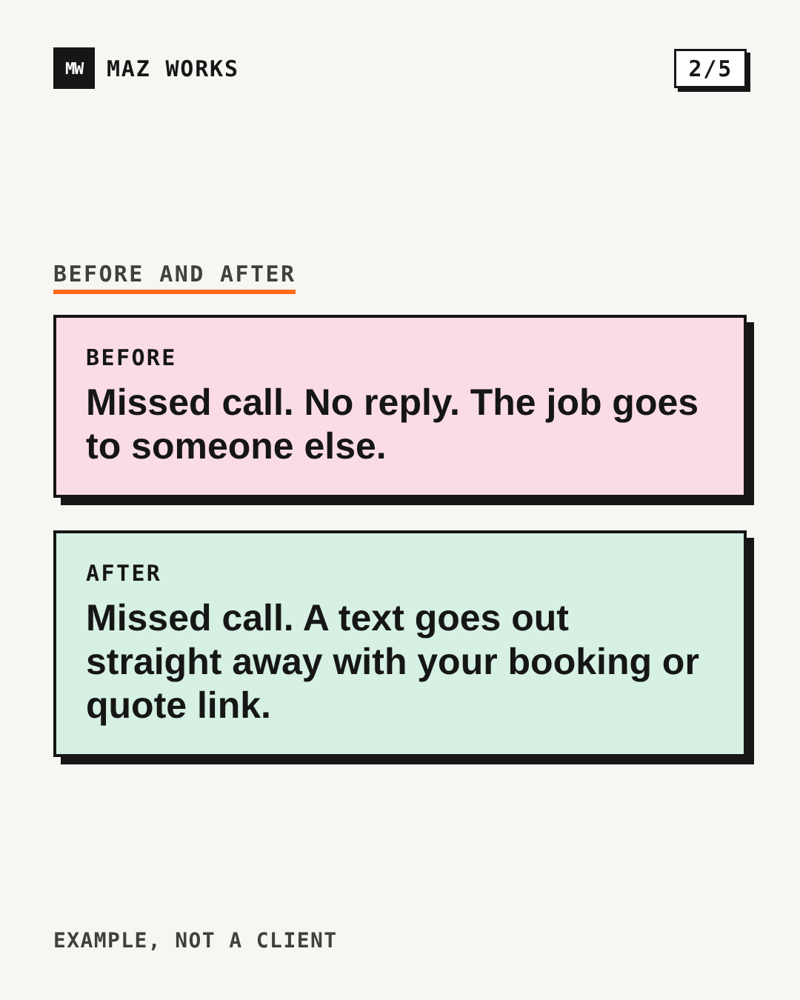
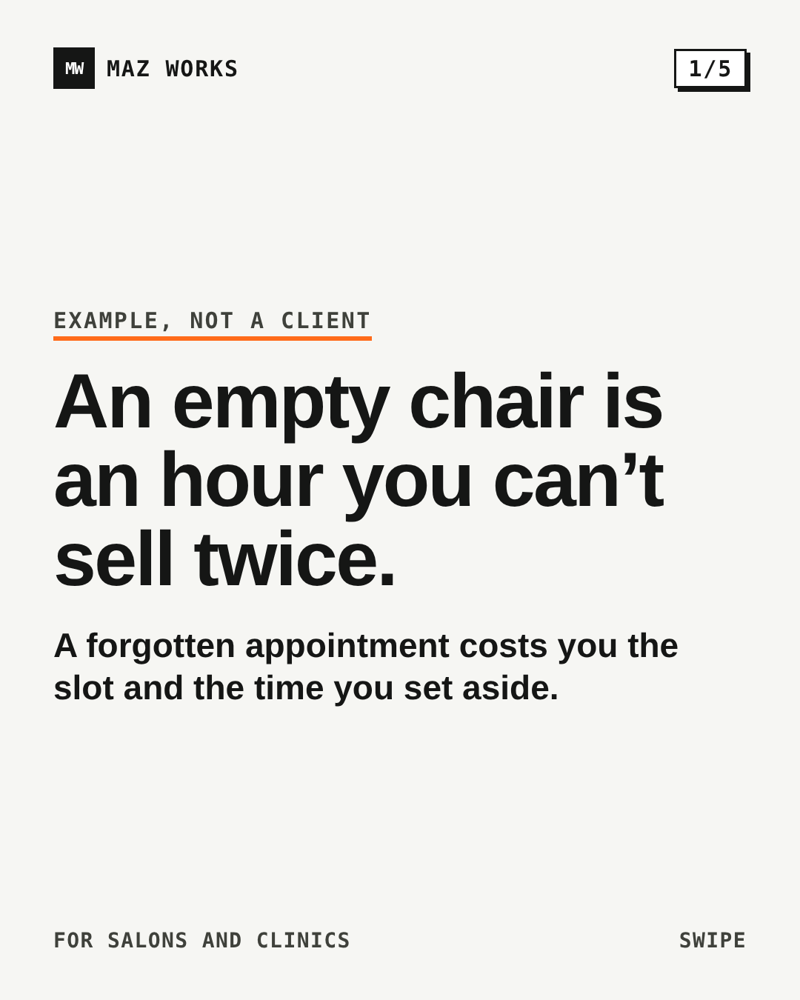
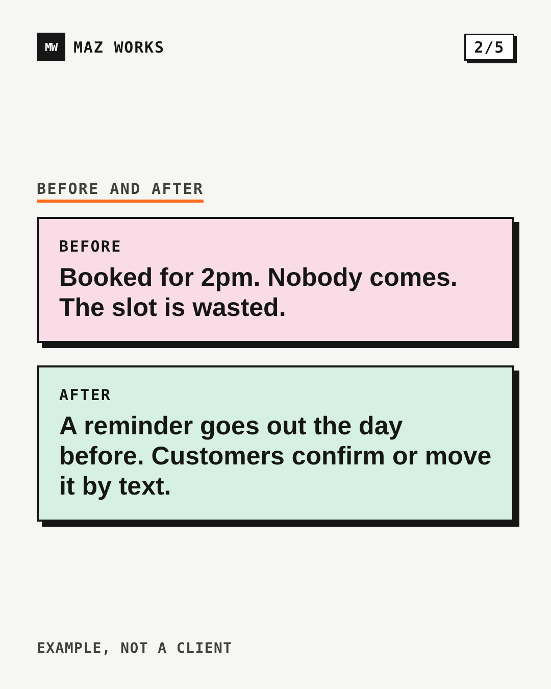
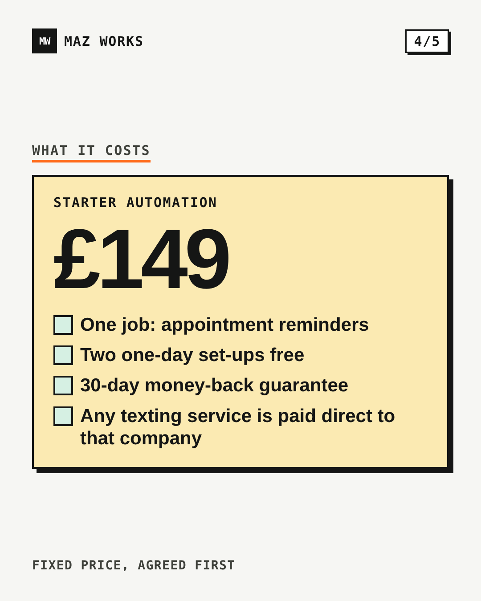
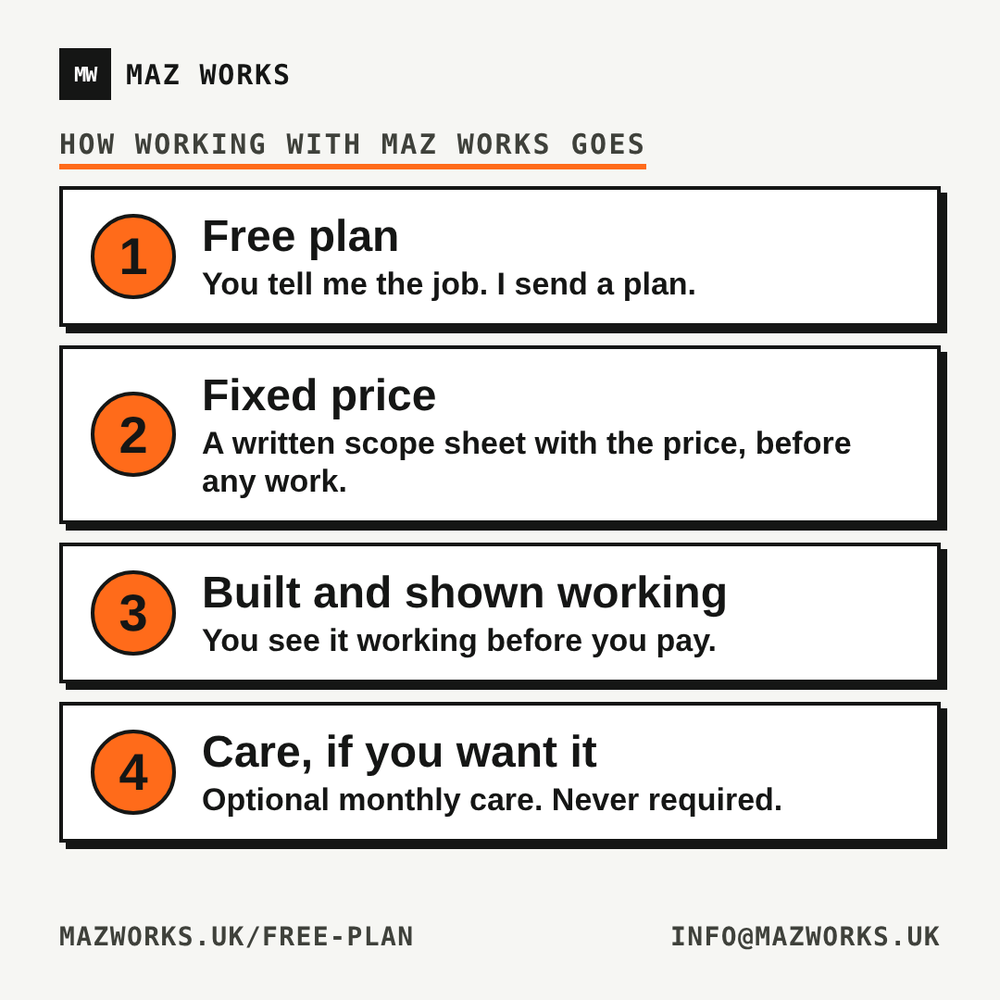
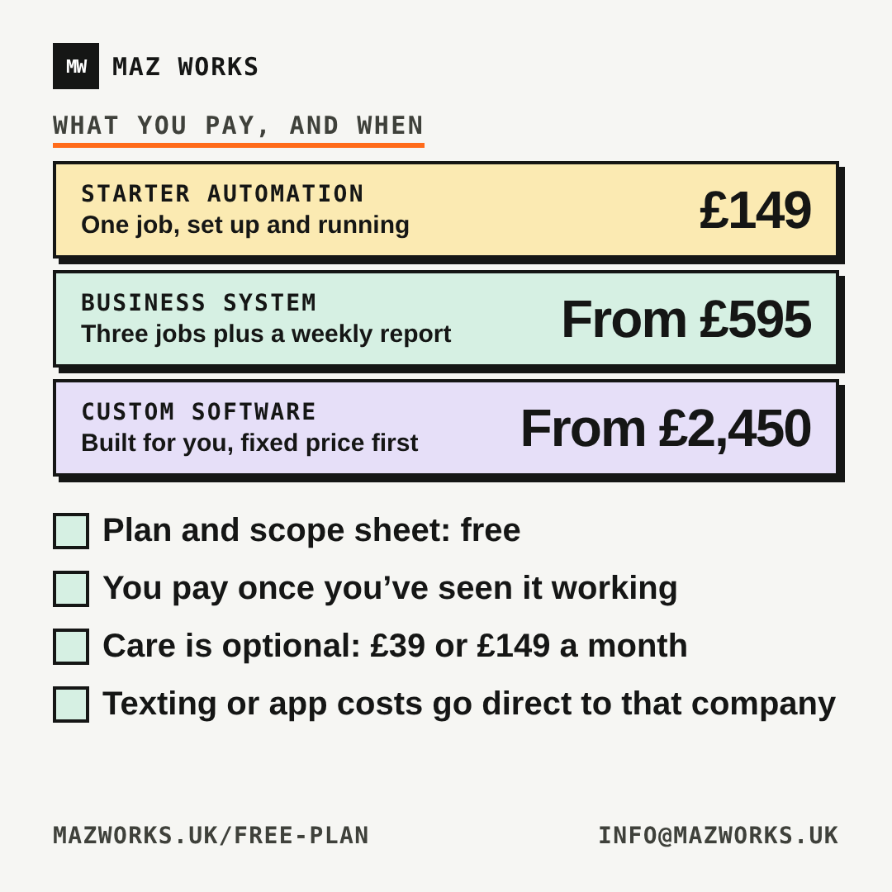

# Promo assets

LinkedIn carousels (1080x1350) and infographics (1080x1080). Sources are standalone HTML in `src/`; PNGs are rendered with Playwright (Chromium) at the same pixel size. Post copy: `POSTS.md`. Prices come from `app/offers.ts`; if they change, update the slide text and re-render. Every scenario is labelled "Example, not a client".

| Asset | Question it answers | Files | src tag |
|---|---|---|---|
| Carousel 1: missed calls to booked jobs (trades) | What if I miss a call? | `li-carousel1-1.png` to `-5.png` | `li-carousel1` |
| Carousel 2: no-shows to reminders (appointments) | What about no-shows? | `li-carousel2-1.png` to `-5.png` | `li-carousel2` |
| Infographic: how working with Maz Works goes | What happens after I ask? | `info-how-it-goes.png` | `li-info1` |
| Infographic: what you pay and when | What does it cost, and when do I pay? | `info-what-you-pay.png` | `li-info2` |

Link format: `https://www.mazworks.uk/free-plan?src=<tag>`. Carousel slide 5 shows its own link; the infographics show `mazworks.uk/free-plan` and the tagged link goes in the first comment.

## Thumbnails

Carousel 1:     

Carousel 2:     

Infographics:  

Alt text for each: the headline on the slide, read in order (carousel 1: phone missed, before and after, three steps, Starter Automation price and what it includes, Get my free plan).
